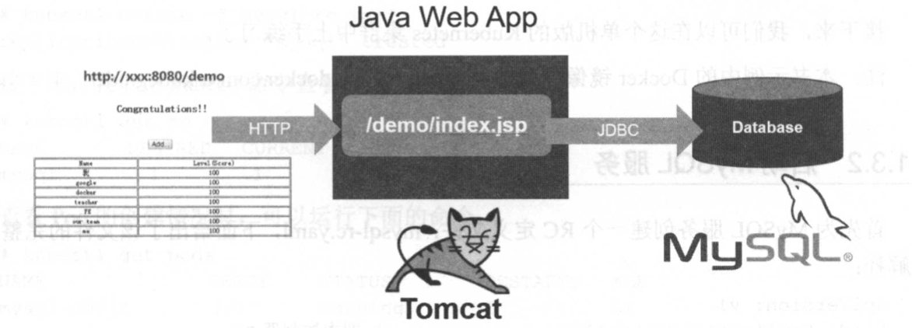

# 1.3 从一个简单的例子开始

考虑到 Kubernetes 提供的 PHP+Redis 留言板的 Hello World 例子对于绝大多数刚接触 Kubernetes 的人来说比较复杂，难以顺利上手和实践，所以在此将其替换成一个简单得多的 Java Web 应用例子，可以让新手快速上手和实践。

此 Java Web 应用的结构比较简单，是一个运行在 Tomcat 里的 Web App。JSP页面通过JDBC直接访问MySQL数据库并展示数据。出于演示和简化的目的，只要程序正确连接到数据库，就会自动完成对应的Table的创建与初始化数据的准备工作。所以，当我们通过浏览器访问此应用时，就会显示一个表格的页面，数据来自数据库。

此应用需要启动两个容器：Web App 容器和 MySQL 容器，并且 Web App 容器需要访问 MySQL 容器。在 Docker 时代，假设我们在一个宿主机上启动了这两个容器，就需要把 MySQL 容器的IP地址通过环境变量注入 Web App 容器里；同时，需要将 Web App 容器的 8080 端口映射到宿主机的 8080 端口，以便在外部访问。在本章的这个例子里，我们介绍在 Kubernetes 时代是如何达到这个目标的。

