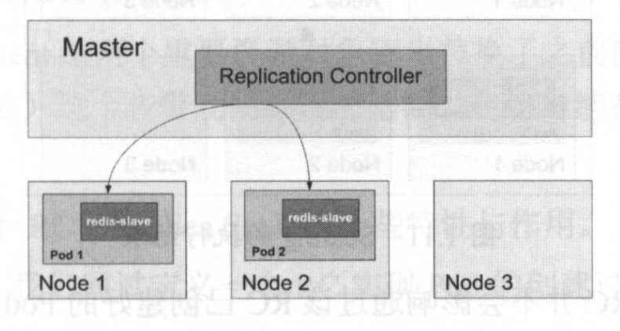
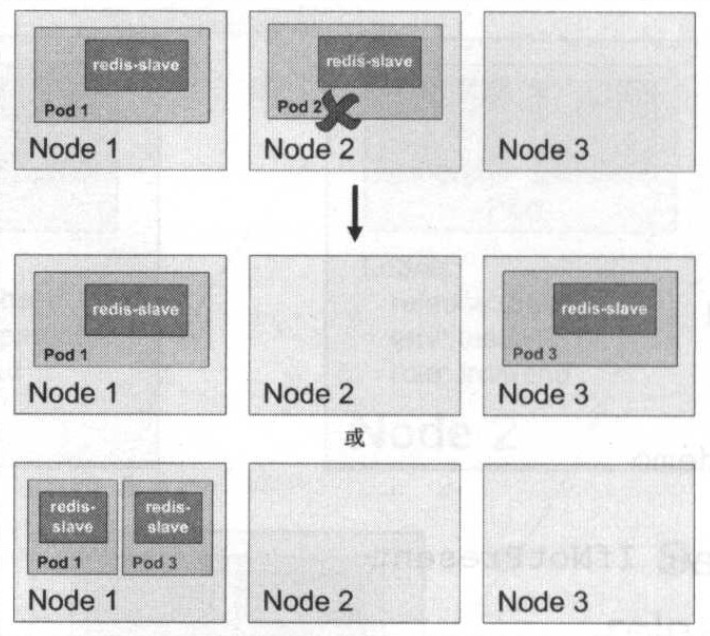
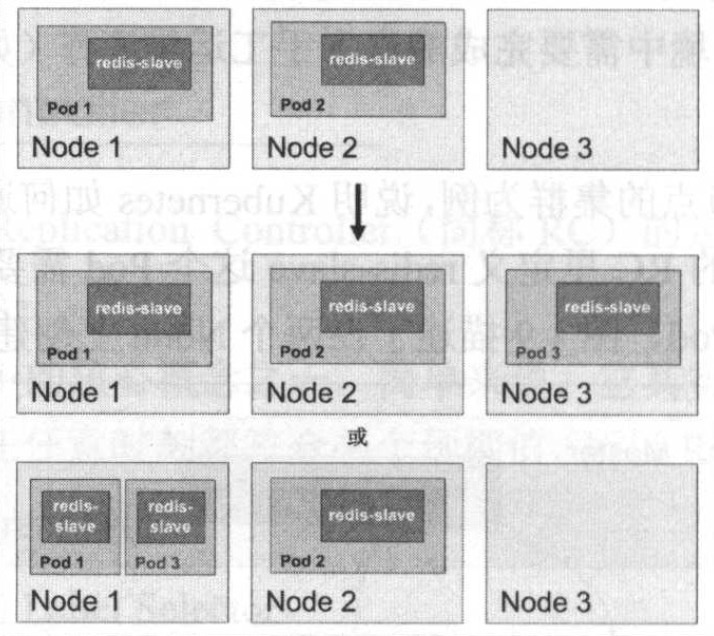

# 1.4.5 Replication Controller

在上一节的例子中已经对 Replication Controller（简称 RC）的定义和作用做了一些说明，本节对 RC 的概念进行深入描述。

RC 是 Kubernetes 系统中的核心概念之一，简单来说，它其实定义了一个期望的场景，即声明某种 Pod 的副本数量在任意时刻都符合某个预期值，所以 RC 的声明包含以下几个部分：
* Pod 期待的副本数量
* 用于筛选目标 Pod 的 Label Selector
* 当 Pod 副本数量小于预期数量时，用于创建新的 Pod 的 Pod 模板（template）

下面是一个完事的 RC 定义的例子，即确保拥有 tier=frontend 标签的这个 Pod（运行 tomcat 容器）在整个 Kubernetes 集群中始终只有一个副本：
```yaml
apiVerison: v1
kind: ReplicationController
metadata:
  name: frontend
spec:
  replicas: 1
  selector:
    tier: frontend
  template:
    metadata：
      labels:
        app: app-demo
        tier: frontend
    spec:
      containers:
      - name: tomcat-demo
        image: tomcat
        imagePullPolicy: IfNotPresent
        env:
        - name: GET_HOSTS_FROM
          values: dns
        ports:
        - containerPort: 80
```

在我们定义了一个 RC 并将其提交到 Kubernetes 集群中后，Master 上的 Controller Manager 组件就得到通知，定期巡检系统中当前戚的目标 Pod，并确保目标 Pod 实例的数量刚好等于 RC 的期望值，如果有过多的 Pod 副本在运行，系统将会停掉一些 Pod，否则系统会再自动创建一些 Pod。可以说，通过 RC，Kubernetes 实现了用户应用集群的高可用性，并且大减少了系统管理员在传统 IT 环境中需要完成的许多手工运维工作（如主机监控脚本、应用监控脚本、故障恢复脚本等）。

## 示例

下面以有 3 个 Node 的集群为例，说明 Kubernetes 如何通过 RC 来实现 Pod 副本数量自动控制的机制。假如在我们的 RC 里定义 redis-slave 这个 Pod 需要保持两个副本，系统将可能在其中的两个 Node 上创建 Pod，如下图所示。



假设 Node 2 上的 Pod 2 意外终止，则根据 RC 定义的 replicas 数量 2，Kubernetes 将会自动创建并启动一个新的 Pod，以保证在整个集群中始终有两个 redis-slave Pod 运行。

如下图所示，系统可能选择 Node 3 或者 Node 1来创建一个新的 Pod。



此外，在运行时，我们可以通过修改 RC 副本数量来实现 Pod 动态伸缩（Scaling），这可以通过执行 `kubectl scale` 命令来一键完成：
```bash
kubectl scale rc redis-slave --replicas=3
```

Scaling 的执行结果如下图所示：



> 注意：删除 RC 并不会影响通过该 RC 已创建好的 Pod。为了删除所有的 Pod，可以设置 replicas 的值为 0，然后更新该 RC。另外 kubectl 提供了 stop 和 delete 命令来一次性删除 RC 和 RC 控制的全部 Pod。

应用升级时，通常会使用一个新的容器镜像版本替代旧版本。我们希望系统平滑升级，比如在当前系统中有 10 个对应的旧版本的 Pod，则最佳的系统升级方式的是旧版本的 Pod 每停止一个，就同时创建一个新版本的 Pod，在整个升级过程中此消彼长，而运行中的 Pod数量始终是 10 个，几分钟后，当所有的 Pod 都已经是新版本时，系统升级完成。通过 RC 机制，Kubernetes 很容易就实现了这种高级实用的特性，被称为『滚动升级』（Rolling Update），具体的操作方法详见 3.11 节的说明。

Replication Controller 由于与 Kubernetes 代码中的模块 Replication Controller 同名，同时 『Replication Controller』无法准确表达它的配音，所在 Kubernetes 1.2 中，升级为另外一个概念 --- Replica Set，官方解释其为『下一代 RC』。Replica Set 与 RC 当前的唯一的区别是，Replica Sets 支持基于集合的 Label Selector，而 RC 只支持基于等式的 Label Selector，这使得 Replica Set 功能更强。下面是等价于之前 RC 例子的 Replica Set 的定义（省去 Pod 模板部分）：
```yaml
apiVersion: v1
kind: ReplicaSet
metadata:
  name: frontend
spec:
  selector:
    matchLabels:
      tier: frontend
    matchExpressions:
      - {key: tier, operator: In, values: [frontend]}
  template:
  ......
```

kubectl 命令行工具适用于 RC 的绝大部分命令同样适用于 ReplicaSet。此外，我们当前很少单独使用 Replica Set，它主要是被 Deployment 这个更高层的资源对象所使用，从而形成一整套 Pod 创建、删除、更新的编排机制。我们在使用 Deployment时，无须关心它是如何创建和维护 Replica Set的，这一切都是自动发生的。

Replica Set 与 Deployment 这两个重要的资源对象逐步替代了之前的 RC 的作用，是 Kubernetes 1.3 里 Pod 自动扩容（伸缩）这个告警功能实现的基础，也将继续在 Kubernetes 未来的版本中发挥重要的作用。

## 总结

最后总结一下 RC（Replica Set）的一些特性与作用：
* 在大多数情况下，我们通过定义一个 RC 实现 Pod 的创建及副本数量的自动控制。
* 在 RC 里包括完整的 Pod 定义模板。
* RC 通过 Label Selector 机制实现对 Pod 副本的自动控制。
* 通过改变 RC 里的 Pod 副本数量，可以实现 Pod 的扩容和缩容。
* 通过改变 RC 里的 Pod 模板中的镜像版本，可以实现 Pod 的滚动升级。
